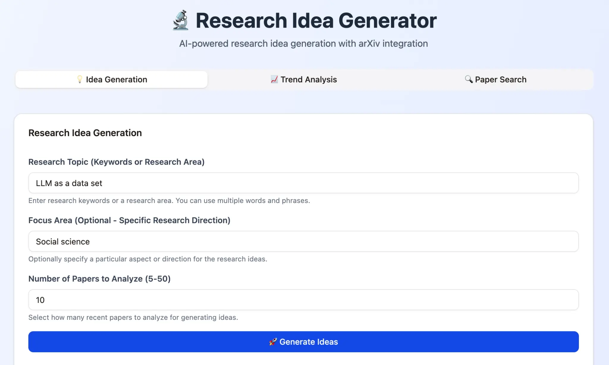

# Research Idea Generator

An AI-powered research idea generation system that leverages arXiv academic papers and Google's Gemini AI to help researchers discover innovative research directions and analyze emerging trends in their field of interest.

## Live Application

**Deployed URL:** https://researchgen-ku6hx7tu.manus.space

## Overview

The Research Idea Generator is a full-stack web application designed to assist researchers in:

- **Generating Novel Research Ideas**: Analyze recent academic papers and use AI to propose innovative, feasible research directions
- **Analyzing Research Trends**: Identify emerging topics, publication trends, and research directions within a specific field
- **Searching Academic Papers**: Discover relevant papers from arXiv with advanced search capabilities

The application integrates with the arXiv API to access a comprehensive database of academic papers and uses Google's Gemini 2.5 Flash model for intelligent analysis and idea generation.

## Key Features

### 1. Research Idea Generation
- Input research topic with multi-word phrase support
- Optional focus area specification
- Configurable number of papers to analyze (5-50)
- AI-generated research ideas with:
  - Detailed background and motivation
  - Research hypotheses
  - Proposed methodologies
  - Feasibility assessments
  - Related bibliography with arXiv links

### 2. Research Trend Analysis
- Analyze publication trends over time
- Identify top research categories
- Discover emerging research topics
- AI-powered trend analysis with reasoning

### 3. Paper Search
- Search arXiv papers by keywords
- Multi-word phrase support
- Results include titles, authors, dates, categories, abstracts
- Direct links to arXiv papers

## Application Screenshot



*Main interface showing the Research Idea Generation tab with input fields for Research Topic, Focus Area, and Number of Papers to Analyze.*

## Research Idea Generation Process

### Three-Stage Reasoning Pipeline

```
┌─────────────────────────────────────────────────────────┐
│  Stage 1: Literature Analysis                           │
│  ├─ Search arXiv for relevant papers                    │
│  ├─ Extract paper metadata (title, authors, date)       │
│  └─ Collect abstracts and research context              │
└────────────────────┬────────────────────────────────────┘
                     │
                     ▼
┌─────────────────────────────────────────────────────────┐
│  Stage 2: Research Direction Generation                 │
│  ├─ Analyze paper abstracts and trends                  │
│  ├─ Identify research gaps and opportunities            │
│  └─ Generate 3 innovative research directions           │
└────────────────────┬────────────────────────────────────┘
                     │
                     ▼
┌─────────────────────────────────────────────────────────┐
│  Stage 3: Detailed Idea Development                     │
│  ├─ Create comprehensive idea descriptions              │
│  ├─ Define methodologies and approaches                 │
│  ├─ Assess feasibility and impact                       │
│  └─ Link to relevant bibliography (arXiv papers)        │
└─────────────────────────────────────────────────────────┘
```

## Technology Stack

### Frontend
- **Framework**: React 19 with TypeScript
- **UI Components**: shadcn/ui
- **Styling**: Tailwind CSS 4
- **State Management**: React Hooks
- **RPC Client**: tRPC 11

### Backend
- **Runtime**: Node.js 22
- **Framework**: Express 4
- **RPC Framework**: tRPC 11
- **Database**: MySQL with Drizzle ORM
- **AI Integration**: Google Gemini 2.5 Flash (via Manus built-in LLM service)

### External APIs
- **arXiv API**: Academic paper database
- **Manus LLM Service**: Google Gemini model integration
- **Manus OAuth**: User authentication

### Infrastructure
- **Platform**: Manus full-stack web application platform
- **Database**: MySQL (managed)
- **Storage**: S3 (via Manus storage helpers)
- **Deployment**: Manus automatic deployment

## Architecture

```
┌─────────────────────────────────────────────────────────┐
│                    Frontend (React 19)                  │
│  ┌──────────────────────────────────────────────────┐ 　 　│
│  │  Home.tsx (Multi-tab UI)                         │ 　　 │
│  │  ├─ Idea Generation Tab                          │ 　　 │
│  │  ├─ Trend Analysis Tab                           │ 　　 │
│  │  └─ Paper Search Tab                             │ 　　 │
│  └──────────────────────────────────────────────────┘ 　　 │
│                        │                                │
│                        ▼ (tRPC calls)                   │
└─────────────────────────────────────────────────────────┘
                         │
                         ▼
┌─────────────────────────────────────────────────────────┐
│              Backend (Express 4 + tRPC 11)              │
│  ┌──────────────────────────────────────────────────┐  　　│
│  │  server/routers.ts (tRPC Router)                 │ 　　 │
│  │  ├─ research.generateIdeas                       │ 　　 │
│  │  ├─ research.analyzeTrends                       │  　　│
│  │  └─ research.searchPapers                        │ 　　 │
│  └──────────────────────────────────────────────────┘  　　│
│                        │                              　　 │
│                        ▼                              　　 │
│  ┌──────────────────────────────────────────────────┐  　　│
│  │  server/research.ts (Business Logic)             │ 　　 │
│  │  ├─ searchArxivPapersSimple()                    │ 　　 │
│  │  ├─ generateResearchIdeas()                      │ 　　　　│
│  │  ├─ analyzeTrends()                              │  　　│
│  │  └─ searchArxivPapers()                          │ 　　 │
│  └──────────────────────────────────────────────────┘ 　　 │
│                        │                                │
│         ┌──────────────┼──────────────┐                 │
│         ▼              ▼              ▼                 │
│    ┌────────┐    ┌─────────┐    ┌──────────┐           　　│
│    │ arXiv  │    │ Gemini  │    │ Database │          　　 │
│    │  API   │    │   LLM   │    │ (MySQL)  │           　　│
│    └────────┘    └─────────┘    └──────────┘          　　 │
└─────────────────────────────────────────────────────────┘
```

## Deployment Guide

### Prerequisites
- Node.js 22+
- pnpm package manager
- Manus platform account
- Google Gemini API access (via Manus)

### Local Development

1. **Clone the repository**
   ```bash
   git clone https://github.com/tomoto0/research-idea-generator.git
   cd research-idea-generator
   ```

2. **Install dependencies**
   ```bash
   pnpm install
   ```

3. **Set up environment variables**
   Create a `.env` file based on `.env.example`:
   ```
   DATABASE_URL=your_mysql_connection_string
   JWT_SECRET=your_jwt_secret
   VITE_APP_ID=your_manus_app_id
   OAUTH_SERVER_URL=https://api.manus.im
   VITE_OAUTH_PORTAL_URL=https://portal.manus.im
   BUILT_IN_FORGE_API_URL=https://api.manus.im/forge
   BUILT_IN_FORGE_API_KEY=your_api_key
   ```

4. **Run database migrations**
   ```bash
   pnpm db:push
   ```

5. **Start development server**
   ```bash
   pnpm dev
   ```

### Deployment to Manus Platform

1. **Prepare the project**
   ```bash
   pnpm build
   ```

2. **Push to Manus**
   - Use the Manus Management UI
   - Click the "Publish" button to deploy
   - The application will be automatically built and deployed

3. **Access the deployed application**
   - Visit the provided Manus URL (e.g., https://researchgen-ku6hx7tu.manus.space)

## Project Structure

```
research-idea-generator/
├── client/                          # Frontend application
│   ├── src/
│   │   ├── pages/
│   │   │   ├── Home.tsx            # Main application UI
│   │   │   └── NotFound.tsx         # 404 page
│   │   ├── components/              # Reusable UI components
│   │   ├── contexts/                # React contexts
│   │   ├── hooks/                   # Custom hooks
│   │   ├── lib/
│   │   │   └── trpc.ts             # tRPC client configuration
│   │   ├── const.ts                 # Application constants
│   │   ├── App.tsx                  # Main app component
│   │   ├── main.tsx                 # Entry point
│   │   └── index.css                # Global styles
│   └── public/                      # Static assets
├── server/                          # Backend application
│   ├── _core/                       # Framework core
│   │   ├── context.ts               # tRPC context
│   │   ├── trpc.ts                  # tRPC setup
│   │   ├── llm.ts                   # LLM integration
│   │   ├── cookies.ts               # Cookie handling
│   │   ├── env.ts                   # Environment variables
│   │   └── notification.ts          # Notification system
│   ├── research.ts                  # Research logic
│   │   ├── searchArxivPapersSimple()
│   │   ├── generateResearchIdeas()
│   │   ├── analyzeTrends()
│   │   └── searchArxivPapers()
│   ├── db.ts                        # Database helpers
│   ├── routers.ts                   # tRPC routers
│   └── storage.ts                   # S3 storage helpers
├── drizzle/                         # Database schema
│   ├── schema.ts                    # Table definitions
│   └── migrations/                  # Database migrations
├── package.json                     # Project dependencies
├── tsconfig.json                    # TypeScript configuration
├── vite.config.ts                   # Vite configuration
├── drizzle.config.ts                # Drizzle configuration
└── README.md                        # This file
```

## API Endpoints

### tRPC Procedures

#### `research.generateIdeas`
Generates innovative research ideas based on arXiv papers.

**Input:**
```typescript
{
  topic: string;              // Research topic (required)
  focus_area?: string;        // Optional focus area
  num_papers?: number;        // Number of papers (5-50)
  categories?: string[];      // arXiv categories
}
```

**Output:**
```typescript
{
  success: boolean;
  ideas: Array<{
    title: string;
    overview: {
      background: string;
      research_hypothesis: string;
      significance: string;
      novelty: string;
    };
    methodology: {
      research_design: string;
      data_collection: {
        sources: string[];
        methods: string[];
      };
    };
    feasibility: {
      overall_assessment: string;
    };
    bibliography: Array<{
      title: string;
      authors: string;
      date: string;
      url: string;
      abstract: string;
    }>;
  }>;
  papers_analyzed: number;
}
```

#### `research.analyzeTrends`
Analyzes research trends and identifies emerging topics.

**Input:**
```typescript
{
  topic: string;              // Research topic
  time_range?: string;        // Time range (default: "past_3_years")
  num_papers?: number;        // Number of papers to analyze
  categories?: string[];      // arXiv categories
}
```

**Output:**
```typescript
{
  status: "success" | "error";
  topic: string;
  total_papers_analyzed: number;
  analysis_summary: string;
  trends_by_year: Array<{
    year: string;
    paper_count: number;
  }>;
  top_categories: Array<{
    category: string;
    count: number;
  }>;
  emerging_topics: Array<{
    topic: string;
    reason: string;
  }>;
}
```

#### `research.searchPapers`
Searches arXiv papers by query.

**Input:**
```typescript
{
  query: string;              // Search query
  authors?: string;           // Optional author filter
  limit?: number;             // Results limit (default: 20)
  categories?: string[];      // arXiv categories
}
```

**Output:**
```typescript
{
  status: "success" | "error";
  total_results: number;
  returned_count: number;
  papers: Array<{
    title: string;
    abstract: string;
    date: string;
    url: string;
    categories: string[];
    authors: string;
  }>;
}
```

## Configuration

### Environment Variables

| Variable | Description | Required |
|----------|-------------|----------|
| `DATABASE_URL` | MySQL connection string | Yes |
| `JWT_SECRET` | Session cookie signing secret | Yes |
| `VITE_APP_ID` | Manus OAuth application ID | Yes |
| `OAUTH_SERVER_URL` | Manus OAuth backend URL | Yes |
| `VITE_OAUTH_PORTAL_URL` | Manus login portal URL | Yes |
| `BUILT_IN_FORGE_API_URL` | Manus API endpoint | Yes |
| `BUILT_IN_FORGE_API_KEY` | Manus API key | Yes |
| `VITE_APP_TITLE` | Application title | No |
| `VITE_APP_LOGO` | Application logo URL | No |

## Performance Optimization

- **arXiv API**: Configured to fetch up to 50 papers per query
- **Gemini LLM**: 4096 max output tokens, 40-second timeout
- **Frontend**: React 19 with optimized rendering
- **Database**: Indexed queries for fast lookups

## Error Handling

The application includes comprehensive error handling:
- API call failures with fallback data
- JSON parsing errors with graceful degradation
- Network timeout handling
- User-friendly error messages

## Security Considerations

- **Authentication**: Manus OAuth integration
- **API Keys**: Stored securely in environment variables
- **CORS**: Properly configured for cross-origin requests
- **Input Validation**: All user inputs are validated
- **SQL Injection Prevention**: Drizzle ORM parameterized queries

## Future Enhancements

- Multi-keyword search support (up to 3 keywords)
- Result export to PDF/CSV
- Search history and bookmarking
- User-specific research collections
- Advanced filtering options
- Real-time collaboration features

## Contributing

Contributions are welcome! Please feel free to submit pull requests or open issues for bugs and feature requests.

## License

This project is open source and available under the MIT License.

## Support

For issues, questions, or suggestions, please open an issue on the GitHub repository or contact the development team.

## Acknowledgments

- **arXiv**: For providing access to the academic paper database
- **Google Gemini**: For AI-powered analysis and idea generation
- **Manus Platform**: For full-stack application hosting and infrastructure
- **shadcn/ui**: For beautiful UI components
- **React & TypeScript**: For robust frontend development

---

**Last Updated**: November 2024
**Version**: 1.0.0
**Deployed**: https://researchgen-ku6hx7tu.manus.space

